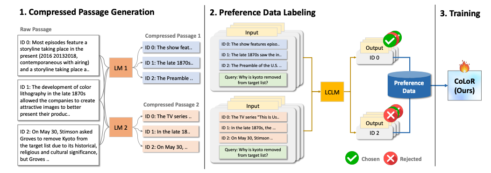

# 📄 Efficient Long Context Language Model Retrieval with Compression



📄 [Read the paper on arXiv](https://arxiv.org/abs/2412.18232)

We propose a new compression approach tailored for Long Context Language Model (LCLM) retrieval, which is trained to maximize the retrieval performance while minimizing the length of the compressed passages.
To accomplish this, we generate the synthetic data, where compressed passages are automatically created and labeled as chosen or rejected according to their retrieval success for a given query, and we train the proposed Compression model for Long context Retrieval (CoLoR) with this data via preference optimization while adding the length regularization loss on top of it to enforce brevity. Through extensive experiments on 9 datasets, we show that CoLoR improves the retrieval performance by 6% while compressing the in-context size by a factor of 1.91.

---

## Datasets
Download the below datasets in the datasets folder.
[LOFT: A 1 Million+ Token Long-Context Benchmark](https://github.com/google-deepmind/loft) 

## Quick Start
Please see in the scripts/run_pipeline.sh

---

## Citing this work

```
@inproceedings{Seo2025CoLoR,
  author       = {Minju Seo and
                  Jinheon Baek and
                  Seongyun Lee and
                  Sung Ju Hwang},
  editor       = {Wanxiang Che and
                  Joyce Nabende and
                  Ekaterina Shutova and
                  Mohammad Taher Pilehvar},
  title        = {Efficient Long Context Language Model Retrieval with Compression},
  booktitle    = {Proceedings of the 63rd Annual Meeting of the Association for Computational
                  Linguistics (Volume 1: Long Papers), {ACL} 2025, Vienna, Austria,
                  July 27 - August 1, 2025},
  pages        = {15251--15268},
  publisher    = {Association for Computational Linguistics},
  year         = {2025},
  url          = {https://aclanthology.org/2025.acl-long.740/},
  timestamp    = {Wed, 24 Sep 2025 15:22:07 +0200},
  biburl       = {https://dblp.org/rec/conf/acl/SeoBLH25.bib},
  bibsource    = {dblp computer science bibliography, https://dblp.org}
}
```
